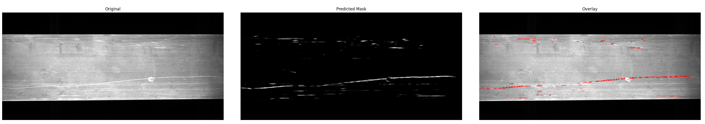

# 裂缝检测系统

这是一个基于深度学习的裂缝检测系统，使用UNet架构实现图像分割，可以准确识别图像中的裂缝区域。

# 图示 demo



## 功能特点

- 使用UNet深度学习模型进行裂缝检测
- 支持多种图像格式（JPG、PNG、BMP）
- 使用Dice系数作为评估指标
- 自动保存最佳模型
- 支持GPU加速训练

## 环境要求

- Python 3.6+
- PyTorch
- torchvision
- PIL
- tqdm

## 安装

1. 克隆仓库：
```bash
git clone [repository-url]
cd [repository-name]
```

2. 安装依赖：
```bash
pip install torch torchvision pillow tqdm
```

## 数据集准备

在`dataset`目录下创建以下结构：
```
dataset/
├── images/    # 原始图像
└── masks/     # 对应的掩码图像
```

## 使用方法

1. 训练模型：
```bash
python main.py
```

2. 使用训练好的模型进行预测：
```bash
python inference.py --image_path [图像路径] --model_path best_unet_model.pth
```

## 模型架构

本项目使用改进的UNet架构：
- 输入通道：3（RGB图像）
- 输出通道：1（二值掩码）
- 特征通道数：32
- 包含4个下采样和上采样层
- 使用批归一化和ReLU激活函数

## 训练参数

- 图像大小：448x448
- 批次大小：4
- 学习率：0.001
- 训练轮数：30
- 优化器：Adam

## 许可证

本项目采用MIT许可证。详见[LICENSE](LICENSE)文件。